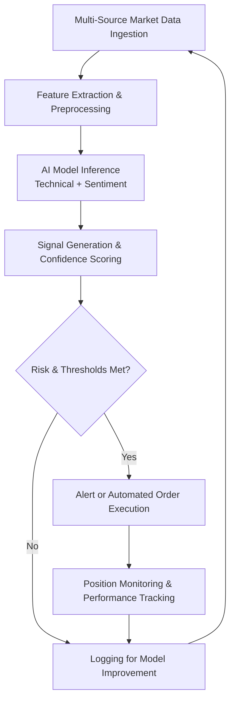

# AI Signal Bot

Deploy AI Signal Bot as a multi-model technical and sentiment analysis execution layer for generating high-probability trading signals with real-time market data, risk scoring, and automated order execution across major exchanges and DEXes.

### Introduction to AI-Driven Trading Signal Systems

Traditional technical analysis is limited by human bias and processing speed. An **AI Signal Bot** functions as a sophisticated **multi-model inference and signal generation engine** that combines technical indicators, on-chain data, and sentiment analysis to produce actionable trading signals.

Traders and quantitative teams use these tools to augment decision-making with data-driven insights and automate execution based on high-confidence signals.

### Inside the System: Core Mechanism

The bot operates as a **real-time data processing and predictive modeling layer**. It ingests:

- Price action and technical indicators
- On-chain metrics and order book data
- Social sentiment and news signals
- Historical pattern recognition from trained models

AI models generate buy/sell signals with confidence scores and risk assessments, which can trigger automated orders or alerts for manual review.

### Target Audience and Practical Use Cases

This execution layer targets:
- Technical traders seeking data-driven signals
- Quantitative developers testing AI models
- Portfolio managers augmenting discretionary trading
- Algorithmic trading system operators

Common applications include:
- **Trend reversal and breakout signals**
- **Mean-reversion opportunities** in ranging markets
- **Volatility-based entry/exit points**
- **Sentiment-driven momentum trading**

### Technical Architecture and Operational Logic

A robust AI Signal Bot includes:

- **Data Ingestion Layer**: Multi-source market and on-chain feeds
- **Feature Engineering Module**: Technical and sentiment feature extraction
- **Multi-Model Inference Engine**: Ensemble of ML/DL models for signal generation
- **Risk Scoring System**: Confidence and risk assessment for each signal
- **Execution & Alert Hub**: Automated trading or notification delivery

**Operational Logic Flowchart**

### Key Features and Technical Advantages

- **Multi-Model Ensemble**: Combines technical, on-chain, and sentiment signals
- **Real-Time Processing**: Low-latency signal generation
- **Risk-Aware Signals**: Confidence scoring and risk assessment
- **Backtesting & Optimization**: Historical validation and model tuning
- **Integration Ready**: Easy connection to trading execution systems

The system provides more nuanced signals than traditional rule-based approaches through AI-driven pattern recognition.

### Where It Fits in the Market: Comparison Table

| Aspect                | AI Signal Bot           | Traditional Indicator Bots | Social Sentiment Tools | Manual Technical Analysis |
|-----------------------|-------------------------|----------------------------|------------------------|---------------------------|
| Signal Sophistication| Multi-model AI         | Rule-based                 | Sentiment-focused      | Human judgment            |
| Speed                | Real-time              | Fast                       | Moderate               | Slow                      |
| Risk Assessment      | Built-in scoring       | Basic                      | Limited                | User-defined              |
| Customization        | High (model tuning)    | Moderate                   | Moderate               | Full                      |
| Best Use Case        | Data-driven trading    | Systematic strategies      | Momentum trading       | Discretionary             |
| Technical Complexity | Moderate to high       | Moderate                   | Low                    | High expertise            |

### Risk Surface and Limitations

AI signal bots have important limitations:
- **Model Risk**: Past performance does not guarantee future accuracy
- **Overfitting**: Models may perform well in backtests but fail live
- **Data Quality**: Garbage in, garbage out – poor data affects signals
- **Market Regime Changes**: Models may not adapt quickly to new conditions
- **Black Box Nature**: Some AI decisions may lack full explainability

**Optimization Note**: Use ensemble models, regularly retrain on fresh data, combine with human oversight, implement strict risk management, and backtest thoroughly across different market regimes. Never rely solely on AI signals for trading decisions.

### Deployment Profile and Getting Started

1. **Infrastructure**: Reliable market data feeds and low-latency execution connections.
2. **Model Setup**: Configure or train models on historical data.
3. **Signal Configuration**: Define thresholds and risk parameters.
4. **Testing**: Extensive backtesting followed by paper trading.
5. **Live Monitoring**: Enable with performance tracking and regular model updates.

Many solutions offer no-code interfaces or Python SDKs for custom model development.

### Conclusion

The AI Signal Bot serves as a powerful intelligent signal generation execution engine for augmenting trading decisions with data-driven insights. Its value lies in multi-modal analysis and risk scoring rather than any guaranteed profitable signals. For technically proficient users who combine it with rigorous risk management and continuous model validation, it provides a significant enhancement to systematic trading strategies.

### FAQ

**How reliable are AI-generated trading signals?**  
They can provide valuable insights but are not infallible. Market conditions change, and no model guarantees profits. Use as one input among many.

**Does it support all major markets?**  
Leading implementations cover major crypto pairs on CEXs and DEXes with regular additions for new assets.

**Can it integrate with trading execution?**  
Yes. API support allows direct connection to order placement systems with user-defined risk rules.

**What are the main risks?**  
Model degradation, overfitting, data quality issues, and over-reliance. Strong risk management and human oversight are essential.

**How does it compare to traditional technical analysis?**  
AI can process more data and detect complex patterns faster than humans, but lacks the contextual judgment of experienced traders. Best results come from combining both approaches.
